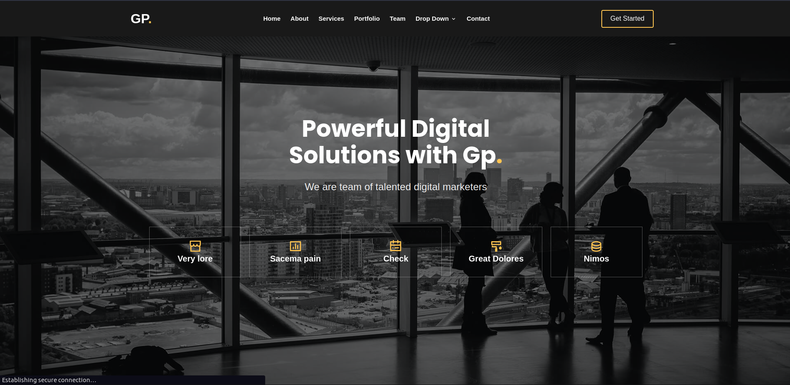

<h1>Digit</h1>

<br >

<hr >

<h4>Description</h4>
Want to outsource a digital marketer ?<br >
Look no <strong>further.</strong> <br >
Digit is a home of professional digital marketers with over 15 years <br >
experience in the game. <br >
With Digit, spend less and increase your business ten fold <br >

<h4>Installation Guide</h4>
I'll assume you already have <strong>Node</strong> installed.

Start by cloning the repo:

```
https://github.com/bismarkboateng/next-ui-pro.git
cd next-ui-pro/
yarn
yarn dev
```

select the link running on your development server to preview<br>
the application